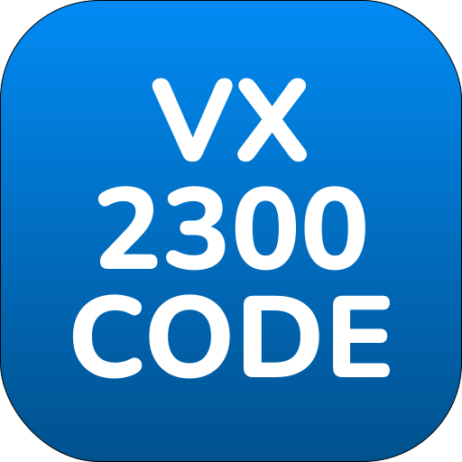

# VX2300 Code Reader

#### Monitora e interpreta i comandi del bus seriale per dispositivi Videx VX2300. Analizza in tempo reale il traffico seriale, decodifica i comandi e visualizza un output formattato con codifica a colori per una facile interpretazione.

## Dispositivi supportati
- serie 4312
- serie ERA

## Funzionalità
- **Auto-rilevamento dispositivo**: Rileva automaticamente i dispositivi VX2300 collegati
- **Interpretazione comandi**: Decodifica i codici dei comandi in nomi comprensibili
- **Codifica a colori**: Visualizzazione intuitiva basata sul tipo di dispositivo:
  - 🟨 Giallo: Centralino
  - 🟩 Verde: Citofono appartamento
  - 🟦 Blu: Posto esterno
  - 🟪 Viola: Relè
  - 🟥 Rosso: Errori/comandi sconosciuti
- **Logging automatico**: Salvataggio automatico dei log in caso di errori nella seriale
- **Comandi da tastiera**:
  - Ctrl+X: Pulisci lo schermo
  - Ctrl+W: Salva log in un file txt
  - Ctrl+C: Esci dal programma

## Modalità di Utilizzo

### Prerequisiti
Installa il driver USB seriale FT232 [a questo link](https://ftdichip.com/wp-content/uploads/2025/03/CDM2123620_Setup.zip)

### Esecuzione
1. Collega il dispositivo VX2300 via USB
2. Esegui lo script

### Istruzioni
1. Seleziona una porta seriale dal menu:
   - `0` per auto-rilevamento dispositivo
   - Numeri `1`+ per selezione manuale

2. Il sistema inizierà ora a monitorare il traffico seriale

3. Utilizza i comandi da tastiera per interagire col monitor

### Log Automatici
I log vengono salvati automaticamente (in caso di errori nella seriale):
- Nella directory dello script o sul desktop
- Formato nome file: `VX2300_log_YYYYMMDD_HHMMSS.txt`
